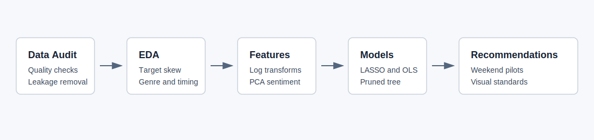
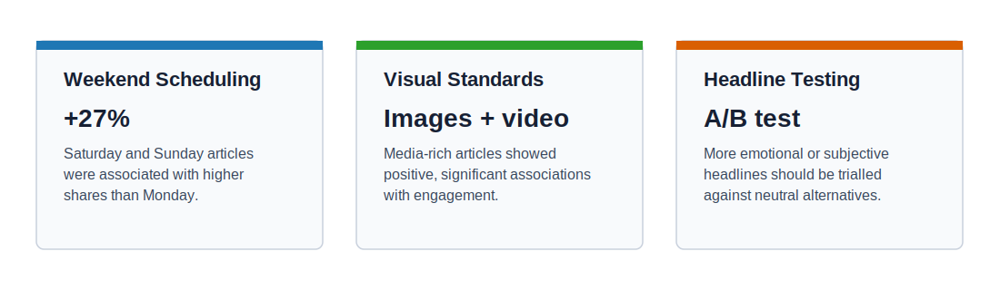

# Marketing Content Engagement Analysis

This project analyses article-level media performance data to identify which editorial and content features are associated with higher social sharing. It is presented as a recruiter-friendly analytics case study focused on business problem framing, modelling choices, interpretation, and practical recommendations.

## Business Problem

An online publisher wants to improve article engagement by understanding which controllable content features are linked to higher social shares. The analysis asks:

> Which article features, publishing choices, and content characteristics are associated with higher sharing, and how should management act on those insights?

The work focuses on three practical decisions:

- when to publish content
- how much visual content to include
- how headline tone and subjectivity relate to engagement

## Project Summary

The dataset contained 39,644 online news articles and 61 variables covering article structure, publication day, genre, sentiment, subjectivity, keyword features, linked-article features, and total engagement measured as shares.

One corrupted record was removed, leaving 39,643 usable articles. Leakage variables were excluded where they reflected historical keyword or referenced-article performance that would not be available at publication time.

## Key Findings

| Finding | Evidence | Business Interpretation |
|---|---:|---|
| Weekend publication performed better | Saturday and Sunday were associated with roughly 27% more shares than Monday | Evergreen content should be tested in weekend publishing slots |
| Genre was a major segmentation driver | Social Media articles were associated with 69.1% more shares than International articles | Content strategy should be evaluated by genre, not only overall averages |
| Visual features mattered | Image count, video count, and external links were positive and statistically significant | Minimum visual standards may improve engagement |
| Headline framing mattered | Title sentiment and title subjectivity were positive and significant | Emotional or curiosity-driven headline testing is worth trialling |
| Historical exposure time was not a driver after controls | Days elapsed was not statistically significant | Engagement differences were better explained by content and publishing features than by age alone |

## Methods

The analysis followed a structured analytics workflow:



1. Data quality checks and screening
2. Target variable analysis
3. Feature selection and leakage prevention
4. Principal Component Analysis for correlated micro-sentiment variables
5. LASSO variable selection
6. OLS regression for interpretable driver analysis
7. Pruned decision tree for segmentation and managerial rules
8. Robustness checks using an alternative train/test split

## Model Performance

| Model | Purpose | Test Metric |
|---|---|---:|
| Naive baseline | Predict mean log engagement | RMSE 0.9137 |
| LASSO | Variable selection and predictive benchmark | RMSE 0.8779 |
| OLS regression | Interpretable driver analysis | RMSE 0.8779 |
| Pruned decision tree | Non-linear segmentation | MAE-focused comparison |

The OLS model achieved an adjusted R-squared of 0.0864. This is reasonable for behavioural sharing data, where article-level metadata cannot capture all social, algorithmic, and audience effects.

## Recommendations



### 1. Pilot Weekend Scheduling

Run a three-month pilot shifting evergreen Tech and Lifestyle articles to weekend slots. Track average shares per article and compare against similar weekday content.

### 2. Introduce Minimum Visual Standards

Set a default minimum of two images per article, with video prioritised for high-value Social Media and Tech content. Track shares before and after implementation by genre.

### 3. Run Headline A/B Tests

Test more emotional or subjective headlines against neutral alternatives on matched articles. Measure share uplift over a six-week test window and only scale if the effect is stable across genres.

## Repository Structure

```text
marketing-content-engagement-analysis/
|-- assets/
|   |-- key_recommendations.svg
|   `-- project_workflow.svg
|-- data/
|   |-- README.md
|   `-- raw/
|       `-- .gitkeep
|-- docs/
|   `-- data_dictionary.md
|-- results/
|   `-- model_summary.md
|-- scripts/
|   `-- marketing_engagement_analysis.R
|-- .gitignore
`-- README.md
```

## How To Run

The full raw dataset is not included in this portfolio repository. To reproduce the analysis locally:

1. Place `Global_media_data.csv` in `data/raw/`.
2. Open R or RStudio from the repository root.
3. Run:

```r
source("scripts/marketing_engagement_analysis.R")
```

The script expects the same column names documented in [docs/data_dictionary.md](docs/data_dictionary.md).

## Tools And Skills Demonstrated

- R
- tidyverse
- exploratory data analysis
- data quality checks
- feature engineering
- leakage prevention
- PCA
- LASSO regression
- OLS regression
- decision tree modelling
- model interpretation
- business recommendations

## Limitations

The findings are observational associations, not causal effects. The recommendations should therefore be validated through controlled A/B testing before full rollout. The data covers articles published between 2013 and 2015, so model relevance should also be checked against newer platform behaviour and content formats.

## Academic Note

This project was adapted from MSc Business Analytics coursework and rewritten as a professional portfolio case study. University submission material, marking templates, student identifiers, assignment briefs, and raw coursework documents have been excluded from this public-facing version.
